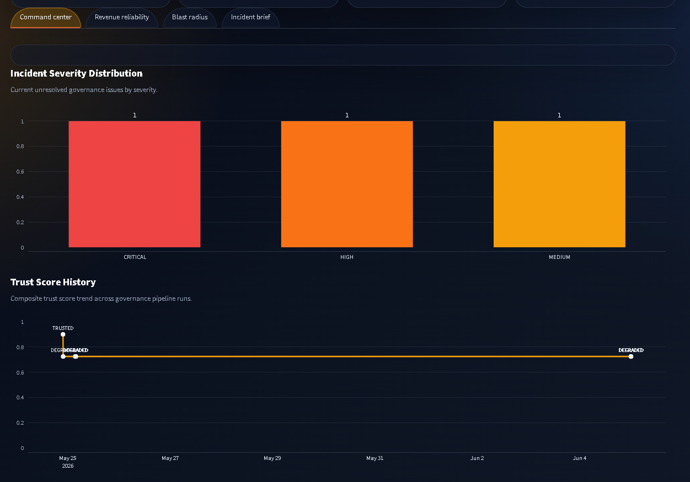
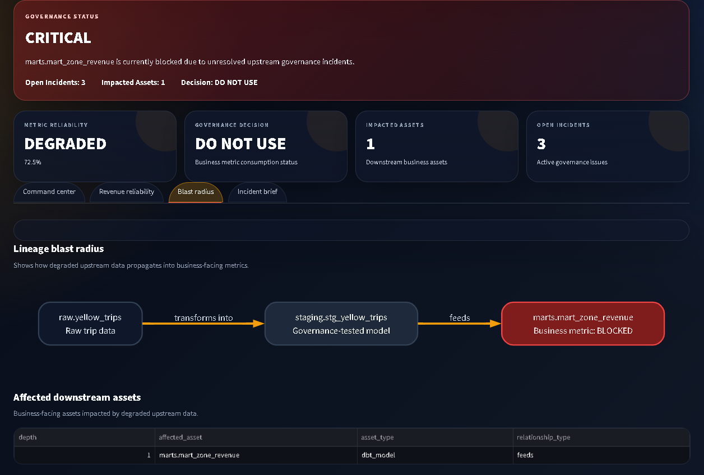
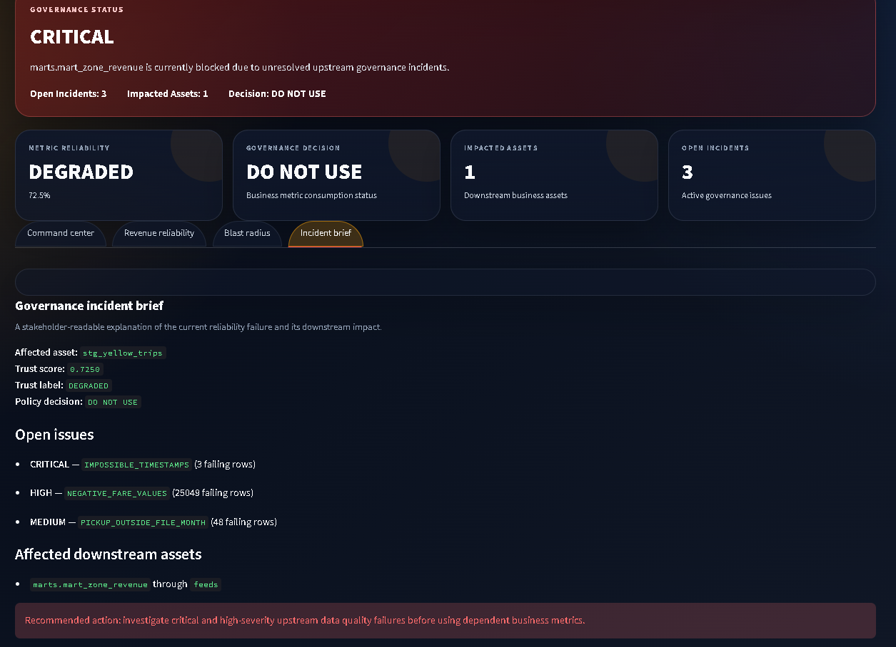

# DataTrust OS

[](https://github.com/SomeshZanwar/Datatrust-OS/actions/workflows/python-tests.yml)

**DataTrust OS** is a governance-aware analytics reliability system that determines whether a business metric is safe to use before analysts or stakeholders act on it.

The project combines data quality testing, trust scoring, governance incident management, lineage blast-radius analysis, policy evaluation, and a Streamlit command center into one end-to-end workflow.

It is built around a simple idea:

> A business metric without trust context is incomplete output.

---

## Why this project exists

Analytics teams often build dashboards and marts that answer business questions, but the reliability context behind those numbers is usually hidden.

A revenue metric may look correct in a dashboard while upstream data has:

- impossible timestamps
- negative financial values
- records outside expected reporting windows
- unresolved quality failures
- downstream reports affected by bad inputs

DataTrust OS makes those reliability signals visible and operational.

Instead of only producing a metric, it answers:

- Is this metric safe to use?
- What data quality issues exist upstream?
- What trust score does the asset currently have?
- Which downstream assets are impacted?
- Should analysts use this metric, use it with caution, or block it?
- What should be investigated next?

---

## Current dashboard

### Governance command center



### Lineage blast radius



### Incident report



---

## What DataTrust OS does

DataTrust OS currently supports:

- Raw NYC Taxi data ingestion into PostgreSQL
- dbt staging models
- dbt-based governance tests
- Trust scoring from dbt test results
- Governance incident creation and lifecycle tracking
- Open incident severity classification
- Governance-aware business mart creation
- YAML-based metric reliability policy evaluation
- Lineage and downstream blast-radius analysis
- Rule-generated incident briefs
- Streamlit governance command center
- Trust score history visualization

---

## Architecture

```text
Raw Data
   ↓
dbt Staging Model
   ↓
Governance Tests
   ↓
Trust Scoring Engine
   ↓
Governance Incidents
   ↓
Governance-Aware Business Mart
   ↓
Lineage + Blast Radius
   ↓
Policy Engine
   ↓
CLI + Streamlit Command Center
```

---

## Data flow

The current pipeline uses NYC TLC Yellow Taxi data.

```text
raw.yellow_trips
        ↓
staging.stg_yellow_trips
        ↓
marts.mart_zone_revenue
```

The mart does not only expose business metrics. It embeds governance context directly into the analytical output.

Example columns:

```text
pickup_date
pickup_location_id
zone_name
borough
trip_count
total_revenue
avg_fare
avg_trip_distance
trust_score
trust_label
open_incident_count
highest_open_severity
data_reliability_status
```

This means analysts can see both the metric and the reliability status in the same model.

---

## Governance logic

### Data quality tests

The staging model is tested for basic validity and known governance risks, including:

- null critical fields
- negative fare amounts
- impossible trip timestamps
- pickup timestamps outside the expected file month

Known failing tests are intentionally preserved because the project is designed to show how a governance system responds to bad data rather than pretending bad data does not exist.

Current example failures:

```text
IMPOSSIBLE_TIMESTAMPS: 3 failing rows
NEGATIVE_FARE_VALUES: 25,049 failing rows
PICKUP_OUTSIDE_FILE_MONTH: 48 failing rows
```

---

## Trust scoring

The trust scoring engine reads dbt test results and stores a persistent score in PostgreSQL.

Example output:

```text
Asset: stg_yellow_trips
Tests: 9 passed / 3 failed / 12 total
Test pass rate: 0.7500
Composite trust score: 0.7250
Trust label: DEGRADED
```

Trust scores are stored historically in:

```text
governance.trust_score_runs
```

This allows the dashboard to show trust trends over time.

---

## Governance incidents

Failed governance tests are promoted into first-class incidents.

Example incidents:

| Incident Type | Severity | Status |
|---|---:|---|
| IMPOSSIBLE_TIMESTAMPS | CRITICAL | OPEN |
| NEGATIVE_FARE_VALUES | HIGH | OPEN |
| PICKUP_OUTSIDE_FILE_MONTH | MEDIUM | OPEN |

Incidents include:

- affected asset
- severity
- failure count
- status
- detected timestamp
- last seen timestamp
- resolved timestamp

The incident lifecycle supports updating recurring incidents instead of duplicating them.

---

## Policy engine

Policies are defined in YAML.

Example:

```yaml
policies:
  - policy_name: critical_upstream_incident_blocks_metric
    description: "A metric mart should not be used when a critical unresolved upstream incident exists."
    applies_to_asset_type: dbt_model
    decision: BLOCKED
    severity: CRITICAL
    rules:
      highest_open_severity: CRITICAL
```

Current policy decision:

```text
marts.mart_zone_revenue → BLOCKED
```

The policy engine uses precedence logic:

```text
BLOCKED > USE_WITH_CAUTION > ALLOWED
```

So when a critical upstream issue exists, the business metric is blocked instead of merely flagged for caution.

---

## CLI commands

Run the full governance loop:

```bash
python -m src.cli run-pipeline
```

View latest trust scores:

```bash
python -m src.cli trust-score
```

View open governance incidents:

```bash
python -m src.cli incidents
```

View governance summary:

```bash
python -m src.cli governance-summary
```

View governance-aware revenue metrics:

```bash
python -m src.cli zone-revenue
```

Evaluate reliability policies:

```bash
python -m src.cli evaluate-policies
```

Analyze downstream blast radius:

```bash
python -m src.cli blast-radius staging.stg_yellow_trips
```

Generate incident brief:

```bash
python -m src.cli incident-briefs
```

Run the dashboard:

```bash
streamlit run app.py
```

---

## Example CLI outputs

### Policy evaluation

```text
Policy Evaluation Results

Asset: marts.mart_zone_revenue
Policy: critical_upstream_incident_blocks_metric
Decision: BLOCKED
Severity: CRITICAL
Trust: DEGRADED
Highest Incident: CRITICAL
Reliability Status: DO NOT USE
```

### Incident brief

```text
Governance Incident Brief

Asset: stg_yellow_trips
Trust Score: 0.7250 (DEGRADED)
Policy Status: DO NOT USE

Open Issues
- CRITICAL: IMPOSSIBLE_TIMESTAMPS (3 failing rows)
- HIGH: NEGATIVE_FARE_VALUES (25049 failing rows)
- MEDIUM: PICKUP_OUTSIDE_FILE_MONTH (48 failing rows)

Affected Downstream Assets
- marts.mart_zone_revenue | DO NOT USE | 3 open incidents

Recommended Action
Investigate critical and high-severity upstream data quality failures before using dependent business metrics.
```

---

## Tech stack

- Python
- PostgreSQL
- dbt
- SQLAlchemy
- Typer
- Rich
- Streamlit
- Plotly
- Graphviz
- YAML policy configuration
- NYC TLC Taxi data

---

## Project structure

```text
datatrust-os/
├── app.py
├── dbt_project/
│   ├── macros/
│   ├── models/
│   │   ├── staging/
│   │   └── marts/
│   ├── seeds/
│   └── tests/
├── docs/
│   └── screenshots/
├── policies/
├── sql/
├── src/
│   ├── ingestion/
│   ├── lineage/
│   ├── policy/
│   └── trust/
└── tests/
```

---

## Setup notes

This project expects a local PostgreSQL database named:

```text
datatrust_os
```

with these schemas:

```sql
CREATE SCHEMA raw;
CREATE SCHEMA staging;
CREATE SCHEMA marts;
CREATE SCHEMA governance;
CREATE SCHEMA lineage;
```

Environment variables are loaded from `.env`.

Example:

```env
POSTGRES_HOST=localhost
POSTGRES_PORT=5432
POSTGRES_DB=datatrust_os
POSTGRES_USER=postgres
POSTGRES_PASSWORD=your_password_here
```

Install dependencies:

```bash
pip install -r requirements.txt
```

Run dbt from inside the dbt project folder:

```bash
cd dbt_project
dbt debug --profiles-dir .
dbt seed --profiles-dir .
dbt run --profiles-dir .
dbt test --profiles-dir .
```

Run the governance pipeline from the project root:

```bash
python -m src.cli run-pipeline
```

---

## Current status

DataTrust OS is currently a local working MVP.

Completed:

- raw ingestion
- dbt staging
- governance tests
- trust scoring
- incident management
- incident lifecycle updates
- governance-aware business mart
- lineage tracking
- blast-radius analysis
- YAML policy engine
- incident briefs
- Streamlit dashboard

Planned next:

- support more NYC TLC datasets such as Green Taxi and FHV
- add richer policy rules
- add automated incident resolution demos
- add historical incident trend analysis
- improve dashboard deployment readiness
- add documentation for architecture and demo walkthrough
- add tests for policy and incident logic

---

## Positioning

This project is designed for analytics, data governance, and data reliability use cases.

It demonstrates how a data analyst or analytics engineer can move beyond building dashboards and instead build systems that help teams decide whether metrics are trustworthy enough to use.
